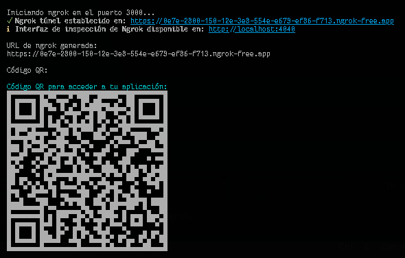

# ngrok-qr-cli

Herramienta de línea de comandos para exponer tu servidor local usando ngrok y mostrar un código QR para compartir fácilmente la URL en otros dispositivos.

> ⚠️ **IMPORTANTE:** Para usar esta herramienta necesitas un token de autenticación de ngrok. [¿Cómo obtenerlo?](#configura-tu-token-de-ngrok)



---

## 🚀 Primeros pasos

### 1. Configura tu token de ngrok

Antes de instalar o ejecutar cualquier comando, necesitas configurar tu token de autenticación:

```bash
npx ngrok authtoken TU_TOKEN_AQUI
```

¿No tienes tu token? Sigue estos pasos:

1. Crea una cuenta en [ngrok.com](https://ngrok.com)
2. Inicia sesión en tu cuenta
3. Ve a [dashboard.ngrok.com/get-started/your-authtoken](https://dashboard.ngrok.com/get-started/your-authtoken)
4. Copia tu token de autenticación
5. Ejecuta el comando anterior reemplazando `TU_TOKEN_AQUI` con tu token

Este paso es necesario solo una vez por dispositivo y el token se guardará automáticamente.

---

## ⚡ Instalación y uso

Puedes usar ngrok-qr-cli de dos formas:

### Uso global (recomendado)

Instala el paquete globalmente:

```bash
npm install -g ngrok-qr-cli
```

Ejecuta el comando:

```bash
ngrok-qr-cli --port 3000
```

- `--port` o `-p`: Puerto local a exponer (por defecto: 3000)

### Uso local (desarrollo)

1. Clona este repositorio:

```bash
git clone https://github.com/tuusuario/ngrok-qr.git
cd ngrok-qr
```

2. Instala las dependencias:

```bash
npm install
```

3. Ejecuta la aplicación:

```bash
npm start
```

Para especificar un puerto personalizado:

```bash
npm start -- -p 8080
```

Modo desarrollo:

```bash
npm run dev
```

---

## 🛠️ Scripts disponibles

- `npm run build` - Compila el proyecto TypeScript a JavaScript
- `npm start` - Ejecuta la aplicación
- `npm run dev` - Inicia la aplicación en modo desarrollo con recarga automática
- `npm run format` - Formatea el código usando Prettier
- `npm run format:check` - Verifica el formato del código

---

## 🔧 Tecnologías utilizadas

- [TypeScript](https://www.typescriptlang.org/) - Lenguaje de programación
- [ngrok](https://ngrok.com/) - Túneles seguros
- [qrcode](https://www.npmjs.com/package/qrcode) - Generación de códigos QR
- [chalk](https://www.npmjs.com/package/chalk) - Estilos en la terminal
- [yargs](https://www.npmjs.com/package/yargs) - Análisis de argumentos CLI
- [ts-node](https://www.npmjs.com/package/ts-node) - Ejecución de TypeScript

---

## 📝 Licencia

Este proyecto está bajo la licencia ISC.

---

## 🤝 Contribuir

¡Las contribuciones son bienvenidas! Por favor, abre un issue o un pull request.

---

## ⚠️ Solución de problemas

Si encuentras el error "Tunnel session failed", asegúrate de:

1. Tener configurado correctamente tu token de autenticación de ngrok
2. Que el puerto que intentas exponer esté disponible
3. Que no haya otro túnel de ngrok activo

---

## 📬 Soporte

¿Tienes dudas, sugerencias o encontraste un bug? Abre un issue en el repositorio o contáctame.
